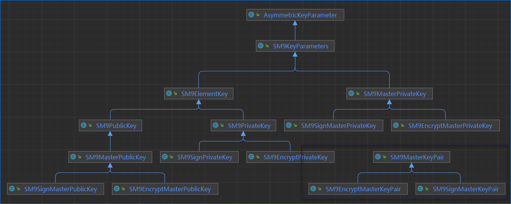

[toc]

# 算法学习研究项目

# 说明

本项目仅用于自我学习，实现了一些密码算法，包括但不限于SM9、IBE、ABE。

开发工具使用 IDEA-2022.2，JDK-1.8-221，使用maven管理JPBC和BC密码库。

算法实现的代码结构参考了 jpbc-crypto 中的算法实现。

目前包含的算法：

- SM9
- SM9gbt

# jpbc

## jpbc-crypto 算法代码结构

参考 jpbc-crypto 中属性基加密算法 GGHSW13 的实现，可以看出它的结构特点：

- generators中是**生成器类**。如密钥对生成器、参数生成器、秘密密钥生成器等。
- engines中是算法实现**引擎类**。如KEMEngine可用来实现密钥封装解封或加密解密。
- params中是算法**参数类**。算法中的生成器、引擎类需要的参数都放在这里。
  生成器和引擎类一般通过 init 方法来初始化要使用的参数，所以需要把某个算法中用到的参数都放置在一个参数类中进行传递。
  比如密钥对生成器 GGHSW13SecretKeyGenerator 秘密密钥生成器中要用到的参数都封装在 GGHSW13SecretKeyGenerationParameters 中。
- 最后在一个**算法类** GGHSW13KEM 中实现论文里提出的算法构造步骤，如 setup、keyGen等。这才是应该使用的算法对象。

## maven 配置 jpbc

项目中主要使用到了 jpbc 中的 `api`、`plaf`、`crypto`这3个库，它们又依赖了 `bcprov` 库。

1. 本地库方式
   可以直接在项目中使用下面的方式配置本地库。
   但由于父项目的本地依赖中的 `systemPath` 无法传递到子项目去，所以需要为每个项目都配置一下。

    ```xml
    <dependency>
        <groupId>it.unisa.dia.gas</groupId>
        <artifactId>jpbc-api</artifactId>
        <version>2.0.0</version>
        <scope>system</scope>
        <systemPath>${pom.basedir}/libs/jpbc-api-2.0.0.jar</systemPath>
    </dependency>

    <dependency>
        <groupId>it.unisa.dia.gas</groupId>
        <artifactId>jpbc-plaf</artifactId>
        <version>2.0.0</version>
        <scope>system</scope>
        <systemPath>${pom.basedir}/libs/jpbc-plaf-2.0.0.jar</systemPath>
    </dependency>

    <dependency>
        <groupId>it.unisa.dia.gas</groupId>
        <artifactId>jpbc-crypto</artifactId>
        <version>2.0.0</version>
        <scope>system</scope>
        <systemPath>${pom.basedir}/libs/jpbc-crypto-2.0.0.jar</systemPath>
    </dependency>

    <dependency>
        <groupId>org.bouncycastle</groupId>
        <artifactId>bcprov-jdk18on</artifactId>
        <version>1.71</version>
        <scope>system</scope>
        <systemPath>${pom.basedir}/libs/bcprov-jdk18on-1.71.jar</systemPath>
    </dependency>
    ```

2. 在线库方式
   也可以使用下面的方式来配置，让maven自动下载。
   这种方式可以只在父项目中配置，然后子项目就可以引用。

    ```xml
    <repositories>
        <repository>
            <id>jitpack.io</id>
            <url>https://www.jitpack.io</url>
            <snapshots>
                <enabled>true</enabled>
            </snapshots>
        </repository>
    </repositories>

    <dependencies>
        <dependency>
            <groupId>com.github.stefano81</groupId>
            <artifactId>jpbc</artifactId>
            <version>v2.0.0-m</version>
            <exclusions>
                <exclusion>
                    <groupId>org.bouncycastle</groupId>
                    <artifactId>bcprov-jdk16</artifactId>
                </exclusion>
            </exclusions>
        </dependency>

        <dependency>
            <groupId>org.bouncycastle</groupId>
            <artifactId>bcprov-jdk18on</artifactId>
            <version>1.71</version>
        </dependency>
    </dependencies>
    ```

   但这种方式又有另外两个问题：

   - 由于 jpbc 引用了 jitpack.io，这会让maven无法从默认的repository中找到jpbc，所以无法下载。特别是在 maven 的 settings.xml 配置了阿里云时，会提示找不到。这时候需要把阿里云的配置中的 `mirrorOf` 修改一下，让其从 jitpack.io 上去找库。如需所示：

    ```xml
    <mirror>
        <id>aliyunmaven</id>
        <mirrorOf>*,!jitpack.io</mirrorOf>
        <name>aliyun-maven</name>
        <url>https://maven.aliyun.com/repository/public</url>
    </mirror>
    ```

   - jpbc中默认使用的BC库版本是 bcprov-jdk16:1.46，这会让IDEA提示“Provides transitive vulnerable dependency”，所以在上面的 jpbc 依赖中添加了 `exclusions` 来排除 `bcprov-jdk16`，然后从小引入依赖 `bcprov-jdk18on`。这个应该和版本有关。

   由于本项目预计包含多个子项目，所以采用第二种方式来配置 jpbc 依赖。因此，需要可能需要修改自己的maven配置文件中的`mirrorOf`。

# SM9

中国商用IBE算法。

此模块实现《GBT 38635》标准。

## 参考文档

部分文档放置在 docs 目录。

- 《GBT 38635-2020 信息安全技术 SM9标识密码算法》共2部分
- 《GMT 0044-2016 SM9 标识密码算法》共5部分
- 《GMT 0080-2020 SM9密码算法使用规范》

## 密钥对

从椭圆曲线的角度来看密钥对：

- 私钥：是 **[1, N-1]** 范围内的一个随机数。**N**是曲线的阶。
- 公钥：**私钥*生成元**。也就是是椭圆曲线上的一个点，等于**生成元**的**私钥**倍。

SM9中的密钥包括：

- 主密钥对

  - **签名主密钥对**：在群**G2**上。只用于签名相关：生成签名私钥，签名，验签
  - **加密主密钥对**：在群**G1**上。用于和签名无关其他情况：生成加密私钥，密钥封装解封，加密解密，密钥协商。
    **注意**：在密钥协商的初始化步骤中产生的临时密钥对也看作是加密主密钥对(参考《GMT 0080-2020》)。

- 用户密钥对

  - 用户私钥：
    这里的用户私钥是一个**群上的点**，是**生成元**的`t2`倍。t2不是随机数，而是通过用户ID、hid和主私钥计算得来的。

    - **签名私钥**：群**G1**上的点。
    - **加密私钥**：群**G2**上的点。

  - **用户公钥**：ID。
    在IBC技术中，用户标识ID可以**唯一确定**用户的公钥，所以就用它来**代表**公钥。而在算法内部实现中可以看到，实际上它还是一个**群上的点**，且和主公钥在同一个群上。也就是说：

    - 内部签名公钥：群**G2**上的点，用于验签。
    - 内部加密公钥：群**G1**上的点，用于密钥封装，加密，密钥协商初始化。

**总结1**：密钥在群上的分布如下表所示。其中主私钥是随机数，除了主私钥和ID，其他密钥都是群上的点。

|    | 加密主私钥 | 签名主私钥 | 公钥:ID| |
|----|----|----|---|---|
| 群G1 | 加密主公钥 | | 签名私钥 | `内部`加密公钥 |
| 群G2 | | 签名主公钥 | 加密私钥 | `内部`签名公钥 |

**总结2**：各个算法中用到的密钥参数如下表所示。

|  密钥 - 算法  | 生成私钥 | 签名 | 验签 | 密钥封装 | 密钥解封 | 加密 | 解密 | 密钥协商初始化 | 密钥协商 |
|----|----|----|----|----|----|----|---|----|----|
|签名主公钥|   | √ | √ |  |  |  |  |  |  |
|签名主私钥| √ |  |  |  |  |  |  |  |  |
|签名私钥  |  | √ |  |  |  |  |  |  |  |
| 公钥:ID | √ |  | √ | √ | √ | √ | √ | √ | √ |
|加密主公钥|  |  |  | √ |  | √ |  | √ | √ |
|加密主私钥| √ |  |  |  |  |  |  |  |  |
|加密私钥  |  |  |  |  | √ |  | √ |  | √ |

### 密钥结构

本项目中的密钥类图如下所示：


")

- 密钥类名称和JPBC略有不同，主要是因为这里要实现全部SM9算法，所以显示第定义了公私钥、签名密钥和加密密钥。后面若要研究基于SM9的ABE，预计会单独提取出加密部分的代码出来，到时候在按照JPBC的风格来实现密钥类。
- 《GMT 0080 6.1-e/f》中的签名私钥类型为加密主公钥，加密私钥类型为签名主公钥。本项目中直接定义了一个共同基类`SM9ElementKey`，表示密钥是曲线上的点。得益于JPBC库中曲线的点都可以用接口`Element`表示，所以这里可以不区分到底是群G1还是G2。
  如果要实现标准中的那种继承关系，则需要在整个密钥链最下面的签名私钥和加密私钥类中，有一个能够设置 isPrivate 属性为 true 的接口，那就需要从顶层向下传递，会在中间的类中定义一些多余的方法，这只在早期代码中实现了一下，后来发现太乱就弃用了。
- 《GMT 0080/6.4》的 6.2/6.3 中把签名数据结构中的S和加密数据结构中的C1描述为签名私钥；6.4 中把密钥封装数据结构中的C描述为加密主公钥。从它们的群属性来说，这样描述是没问题的，但从代码实现上来说，这样看起来有点奇怪，感觉是密钥在泄露。所以只在早期代码中实现了一下，后面也启用这种表示方式，直接使用Element进行抽象的描述。

## 标准差异

相对于GMT，GBT标准中有些不同的地方。在参考了标准中的测试数据后总结如下。

- 密钥协商的**hid**: GMT中为0x02；GBT中为0x03。本代码遵循GBT。
- 签名验签：使用BC的 Singer 接口，含有 update 方法。代码内部使用SM3digest对消息进行**预处理**。标准中的测试数据里没有对消息进行预处理，所以数据有所不一致，为此，可以在内部不使用SM3Digest而是使用ByteArrayOutputStream对数据进行缓存，正如 SM9SignerTest 类一样。
- 加密解密：对于其中使用的分组密码，GMT使用ECB模式，GBT使用CBC模式。同时，在《GMT 0080》中定义了 **EnType** 来表示使用的加密方式：0表示使用基于KDF的序列密码；1,2,4,8分别表示ECB，CBC，OFB，CFB分组密码模式，如果需要向量，则最后要把向量添加到C2头部。填充模式都使用PKCS5填充。
  - 注意1：在GBT的算法流程图中看到，计算C2时就把**IV**添加到前面，后面的C3计算时C2中应该也包含了IV。但对照测试数据，则发现计算C3时的C2里面没有IV。代码实现使用后者。
  - 注意2：IV默认使用的向量是**全0**，代码中添加了一个参数用来表示是否要随机生成IV。
  - 注意3：加密中包含了一个密钥封装的过程，解密中包含了一个密钥解封的过程。所以加密解密类**继承**了封装解封类并调用其方法。
  
## 曲线参数

- 通过曲线参数生成器 SM9ParametersGenerator 可以生成 `SM9Parameters` 对象，该对象中包含了SM9算法代码中需要用到的参数。
- SM9ParametersGenerator 中提供了几个静态 `createParameters` 方法来创建 `SM9Parameters` 对象，支持实时生成曲线参数、从参数中构建、从文件中载入。实时计算参数时使用 SM9CurveGenerator 类。
- 创建 `SM9Parameters` 对象时可以设置一个随机数生成器 random，它会贯穿在整个SM9算法中。
- resources 中的 sm9.properties 文件就是SM9曲线的参数文件；SM9CurveParameters 中也放置了所有参数。
- SM9Pairing 提供 R-ate 功能，封装在内部的 SM9RatePairingMap 中。

## 可配置项

本项目中把SM9中一些可以修改的配置全部提取出来放在了 SM9Config 类中。

|  配置项  | 说明 |
|----|----|
| algDigest | SM9用到的哈希算法，默认为SM3。在 AlgDigest 中定义了多种哈希算法。|
| algSymm | SM9用到的对称算法，默认为SM4。在 AlgSymm 中定义了多种对称算法。 |
| PADDING | SM9用到的对称算法的填充模式，默认为PKCS5Padding。 |
| MAC_KEY_LEN | MAC函数的密钥key的长度。按照MAC函数定义来说，这个长度是可以变的，但最好不小于MAC函数中的哈希函数的哈希值长度。这里默认是32字节。|
| USE_RANDOM_IV | 在GBT标准的测试中，加密中使用了CBC模式，但IV全是0。该参数可以配置是否要生成一个随机IV，默认为否。 |
| HID_SIGN | 签名私钥生成函数识别符。默认为0x01。 |
| HID_KEY_EXCHANGE | 密钥交换时的私钥生成函数识别符。默认为0x03。GMT中是0x02，GBT中是0x03。这里默认配置为GBT标准，但总的来说，应该可以设置为自己想要的值，所以放在这个配置类中，使其可以随意配置。 |
| HID_ENCRYPT | 加密私钥生成函数识别符。默认为0x03。 |

- **注意**：在某些版本的jdk中，有一部分的对称算法(如AES192, AES256)是受到出口限制，导致不能使用。此时可以通过下载特定的包来覆盖解决；也可以使用特定版本的jdk，比如 jdk1.8.0_221 版本就不受限制；另外也可以不使用那些受限的对称算法。

## 源码结构

- engines: 存放算法实现类，共4个，对应SM9的4种算法
- generators: 存放生成器类和pairing类
- parameters: 存放参数类。主要包括曲线参数、算法接口参数类、生成器参数类3种
- struts: 存放结构类，如各密钥、各种算法产生的结果值。
- cipher: 存放对称算法工具和哈希算法
- SM9: 最上层使用的算法类
- SM9Utils: SM9工具类

## 测试

- SM9Test: 测试类，放在 test 中。
  为了验证GBT中最后的测试，在test中把需要注入随机数的算法类重新拷贝一个并添加日志，这样就不影响常规代码。
  SM9Test中的 test_standard 的测试数据和GBT标准相符。
  test_parameters 中测试了参数的生成方法。

# SM9gbt

该项目是从 SM9 修改而来，用作后续的基于SM9的ABE算法。修改项如下：

- 去掉了签名验签和密钥交换，只保留密钥封装解封、加密解密
- 加解密中只适用基于KDF的序列密码算法
- 去掉了不需要的签名相关密钥类，密钥类只有 SM9MasterSecretKey, SM9PublicKey, SM9SecretKey，和JPBC中的示例项目类似，只不过类后面没有加 Parameters 字符串。
- 去掉配置类、曲线生成器和参数生成器，把显示使用曲线参数创建 SM9Parameters 的 createParameters 方法放在了 SM9 中。
- 测试中去掉验证性测试
